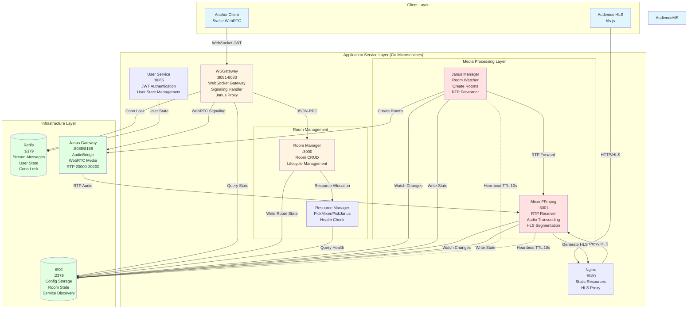
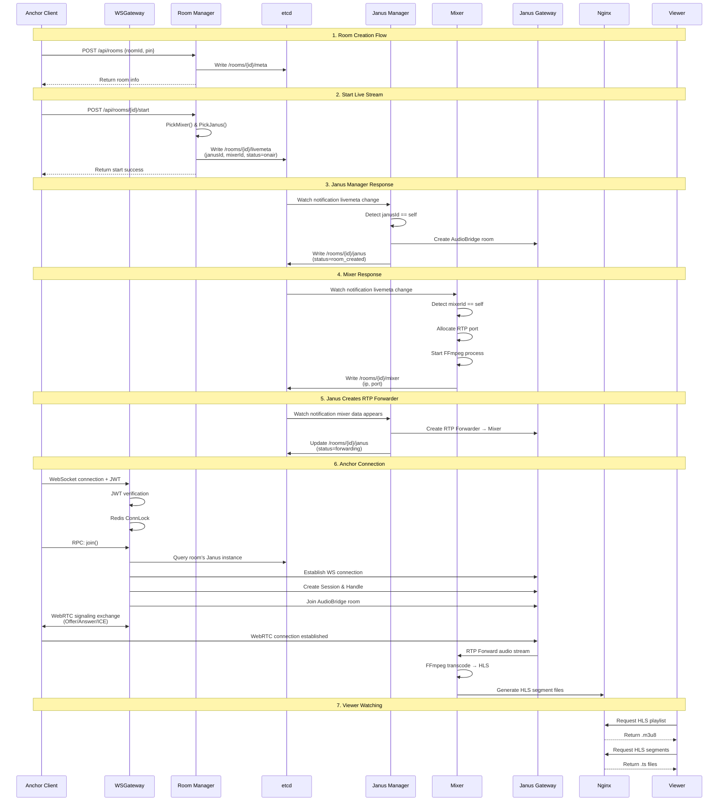
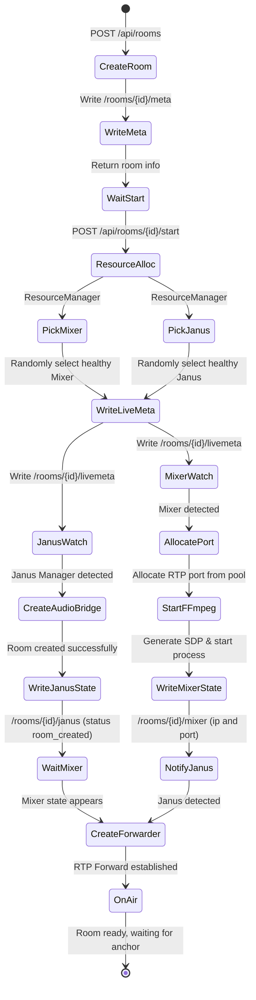
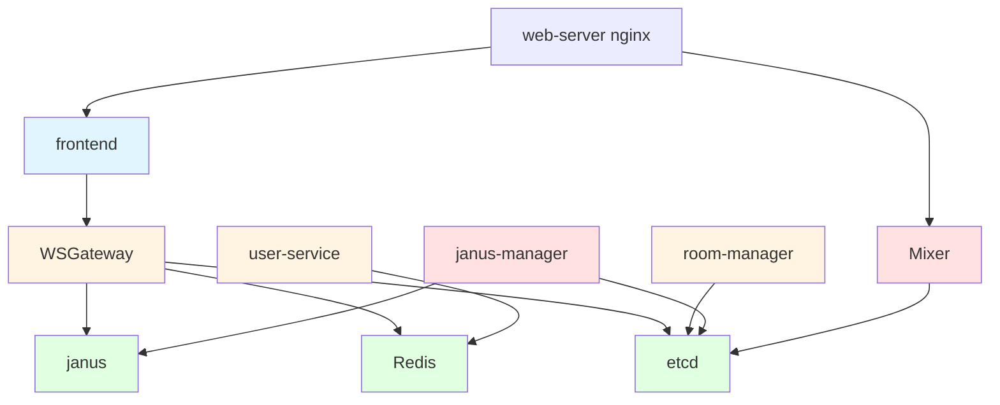

# System Architecture

## Overall System Architecture

```mermaid
graph TB
    subgraph "Client Layer"
        Anchor[Anchor Client<br/>Svelte WebRTC]
        AudienceHLS[Audience HLS<br/>hls.js]
    end

    subgraph "Application Service Layer (Go Microservices)"
        WSGateway[WSGateway<br/>:8081-8083<br/>WebSocket Gateway<br/>Signaling Handler<br/>Janus Proxy]
        Nginx[Nginx<br/>:8080<br/>Static Resources<br/>HLS Proxy]

        subgraph "Room Management"
            RoomMgr[Room Manager<br/>:3000<br/>Room CRUD<br/>Lifecycle Management]
            ResMgr[Resource Manager<br/>PickMixer/PickJanus<br/>Health Check]
        end

        subgraph "Media Processing Layer"
            JanusMgr[Janus Manager<br/>Room Watcher<br/>Create Rooms<br/>RTP Forwarder]
            Mixer[Mixer FFmpeg<br/>:3001<br/>RTP Receiver<br/>Audio Transcoding<br/>HLS Segmentation]
        end

        UserSvc[User Service<br/>:8085<br/>JWT Authentication<br/>User State Management]
    end

    subgraph "Infrastructure Layer"
        etcd[(etcd<br/>:2379<br/>Config Storage<br/>Room State<br/>Service Discovery)]
        Redis[(Redis<br/>:6379<br/>Stream Messages<br/>User State<br/>Conn Lock)]
        Janus[Janus Gateway<br/>:8088/8188<br/>AudioBridge<br/>WebRTC Media<br/>RTP 20000-20200]
    end

    Anchor -->|WebSocket JWT| WSGateway
    AudienceHLS -->|HTTP/HLS| Nginx

    WSGateway -->|JSON-RPC| RoomMgr
    WSGateway -->|Query State| etcd
    WSGateway -->|Conn Lock| Redis
    WSGateway -->|WebRTC Signaling| Janus

    Nginx -->|Proxy HLS| Mixer

    RoomMgr -->|Resource Allocation| ResMgr
    RoomMgr -->|Write Room State| etcd

    ResMgr -->|Query Health| etcd

    JanusMgr -->|Watch Changes| etcd
    JanusMgr -->|Create Rooms| Janus
    JanusMgr -->|RTP Forward| Mixer
    JanusMgr -->|Write State| etcd

    Mixer -->|Watch Changes| etcd
    Mixer -->|Write State| etcd
    Mixer -->|Generate HLS| Nginx

    Janus -->|RTP Audio| Mixer

    UserSvc -->|User State| Redis

    JanusMgr -.->|Heartbeat TTL:10s| etcd
    Mixer -.->|Heartbeat TTL:10s| etcd

    style Anchor fill:#e1f5ff
    style AudienceHLS fill:#e1f5ff
    style AudienceMS fill:#e1f5ff
    style WSGateway fill:#fff4e1
    style RoomMgr fill:#fff4e1
    style JanusMgr fill:#ffe1e1
    style Mixer fill:#ffe1e1
    style etcd fill:#e1ffe1
    style Redis fill:#e1ffe1
    style Janus fill:#e1ffe1
```

## Data Flow Diagram

```mermaid
sequenceDiagram
    participant A as Anchor Client
    participant W as WSGateway
    participant R as Room Manager
    participant E as etcd
    participant J as Janus Manager
    participant M as Mixer
    participant JG as Janus Gateway
    participant N as Nginx
    participant V as Viewer

    Note over A,V: 1. Room Creation Flow
    A->>R: POST /api/rooms {roomId, pin}
    R->>E: Write /rooms/{id}/meta
    R-->>A: Return room info

    Note over A,V: 2. Start Live Stream
    A->>R: POST /api/rooms/{id}/start
    R->>R: PickMixer() & PickJanus()
    R->>E: Write /rooms/{id}/livemeta<br/>(janusId, mixerId, status=onair)
    R-->>A: Return start success

    Note over A,V: 3. Janus Manager Response
    E->>J: Watch notification livemeta change
    J->>J: Detect janusId == self
    J->>JG: Create AudioBridge room
    J->>E: Write /rooms/{id}/janus<br/>(status=room_created)

    Note over A,V: 4. Mixer Response
    E->>M: Watch notification livemeta change
    M->>M: Detect mixerId == self
    M->>M: Allocate RTP port
    M->>M: Start FFmpeg process
    M->>E: Write /rooms/{id}/mixer<br/>(ip, port)

    Note over A,V: 5. Janus Creates RTP Forwarder
    E->>J: Watch notification mixer data appears
    J->>JG: Create RTP Forwarder → Mixer
    J->>E: Update /rooms/{id}/janus<br/>(status=forwarding)

    Note over A,V: 6. Anchor Connection
    A->>W: WebSocket connection + JWT
    W->>W: JWT verification
    W->>W: Redis ConnLock
    A->>W: RPC: join()
    W->>E: Query room's Janus instance
    W->>JG: Establish WS connection
    W->>JG: Create Session & Handle
    W->>JG: Join AudioBridge room
    A<<->>W: WebRTC signaling exchange<br/>(Offer/Answer/ICE)
    A->>JG: WebRTC connection established
    JG->>M: RTP Forward audio stream
    M->>M: FFmpeg transcode → HLS
    M->>N: Generate HLS segment files

    Note over A,V: 7. Viewer Watching
    V->>N: Request HLS playlist
    N-->>V: Return .m3u8
    V->>N: Request HLS segments
    N-->>V: Return .ts files
```

## Room Creation and Resource Allocation Flow

```mermaid
stateDiagram-v2
    [*] --> CreateRoom: POST /api/rooms
    CreateRoom --> WriteMeta: Write /rooms/{id}/meta
    WriteMeta --> WaitStart: Return room info

    WaitStart --> ResourceAlloc: POST /api/rooms/{id}/start
    ResourceAlloc --> PickMixer: ResourceManager
    ResourceAlloc --> PickJanus: ResourceManager

    PickMixer --> WriteLiveMeta: Randomly select healthy Mixer
    PickJanus --> WriteLiveMeta: Randomly select healthy Janus

    WriteLiveMeta --> JanusWatch: Write /rooms/{id}/livemeta
    WriteLiveMeta --> MixerWatch: Write /rooms/{id}/livemeta

    JanusWatch --> CreateAudioBridge: Janus Manager detected
    CreateAudioBridge --> WriteJanusState: Room created successfully
    WriteJanusState --> WaitMixer: /rooms/{id}/janus (status room_created)

    MixerWatch --> AllocatePort: Mixer detected
    AllocatePort --> StartFFmpeg: Allocate RTP port from pool
    StartFFmpeg --> WriteMixerState: Generate SDP & start process
    WriteMixerState --> NotifyJanus: /rooms/{id}/mixer (ip and port)

    WaitMixer --> CreateForwarder: Mixer state appears
    NotifyJanus --> CreateForwarder: Janus detected
    CreateForwarder --> OnAir: RTP Forward established

    OnAir --> [*]: Room ready, waiting for anchor
```

## Docker Compose Service Dependencies

```mermaid
graph TB
    Frontend[frontend] --> WSGateway
    WSGateway --> Janus[janus]
    WSGateway --> Redis
    WSGateway --> etcd
    UserService[user-service] --> Redis
    RoomManager[room-manager] --> etcd
    JanusManager[janus-manager] --> etcd
    JanusManager --> Janus
    Mixer --> etcd
    WebServer[web-server nginx] --> Frontend
    WebServer --> Mixer

    style Frontend fill:#e1f5ff
    style WSGateway fill:#fff4e1
    style UserService fill:#fff4e1
    style RoomManager fill:#fff4e1
    style JanusManager fill:#ffe1e1
    style Mixer fill:#ffe1e1
    style etcd fill:#e1ffe1
    style Redis fill:#e1ffe1
    style Janus fill:#e1ffe1
```
