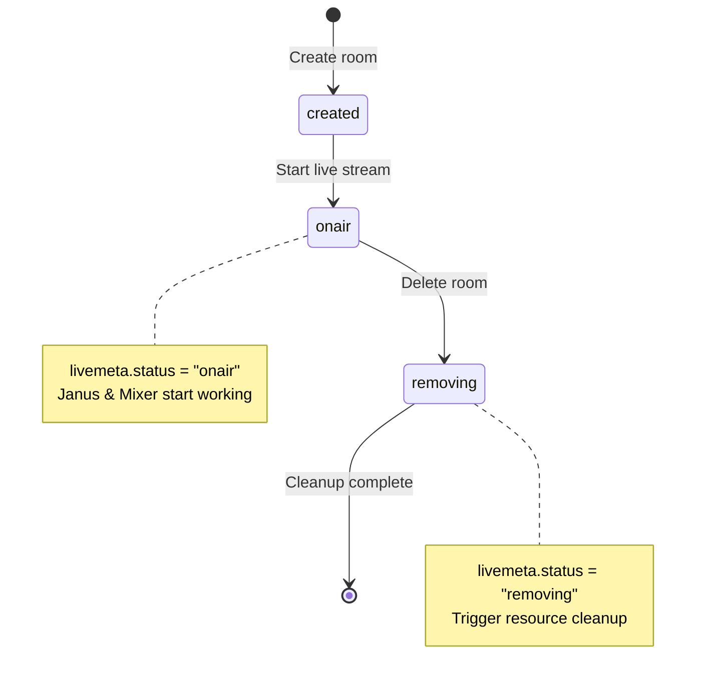
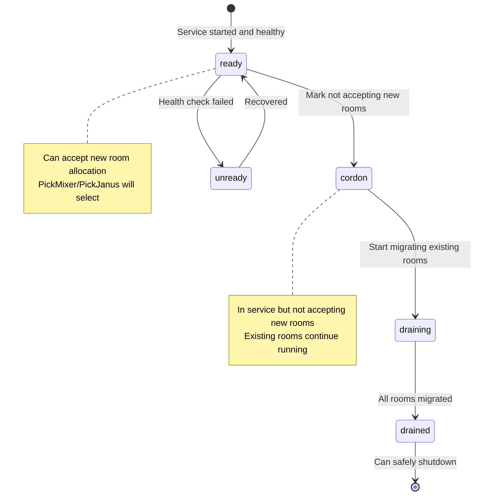

# Data Structures

## etcd Data Structure

```yaml
# use {} to represnet it's a JSON value
rooms:
  room1:
    # room major metadata, set by Room Manager
    meta: {
      "hlsPath": "bw3/stream.m3u8",
      "pin": "56ca11",
      "nonce": "7asjl6sd",
      "createdAt": "2025-12-05T12:03:12.387Z"
    }
    # define live status (e.g. live status, serving modules), managed by Resource Manager
    livemeta: {
      "status": "onair",
      "mixerId": "mixer5",
      "janusId": "jan323"
    }
    # mixer status and info, put by the serving Mixer (here mixer2)
    mixer: {
      "id": "mixer2",
      "host": "192.168.1.2",
      "port": 32323,  # port for RTC
      "hlsPort": 33445, # port for HLS
      "status": "ready"
    }
    # janus status and info, put by the serving Janus Manager (here janus3)
    "janus": {
      "id": "janus3",
      "janusRoomId": 23262,
      "status": "ready"
    }
  room2:
    meta: {
      "roomId": "bw727",
      "janusRoomId": 13262,
      "hlsPath": "bw727/stream.m3u8",
      "pin": "7nca11",
      "createdAt": "2025-12-05T12:04:12.387Z"
    }
    livemeta: {
      "status": "removing"
    }

mixers:
  mixer1:
    # mark label is set by Resource Manager via RESTful API with user-defined TTL
    # healthy: serving, accept new streams
    # cordon: serving, but do not accept new streams
    # draining: migrating streams to other mixers
    mark: {
      label: "ready"
    }
    # heartbeat is reported by Janus Manager periodically with lease TTL
    heartbeat: {
      "status": "healthy",
      "streams": 3,
      "heartbeat": "2025-12-05T12:04:12.387Z"
    }
  mixer2:
    mark: {
      label: "drain"
    }
    heartbeat: {
      "status": "draining",
      "stream": 6,
      "heartbeat": "2025-12-05T12:04:12.387Z"
    }

januses:
  jansus1:
    mark: {
      label: "ready"
    }
    heartbeat: {
      "status": "healthy",
      "streams": 3,
      "heartbeat": "2025-12-05T12:04:12.387Z"
    }
  jansus3:
    mark: {
      label: "cordon"
    }
    heartbeat: {
      "status": "healthy",
      "streams": 2,
      "heartbeat": "2025-12-05T12:04:12.387Z"
    }

```

## Redis Data Structure

```yaml
# Room Tracking Hash - tracks all active rooms
{prefix}:rooms:
  # Hash: roomID -> Unix timestamp (room creation time)
  "room1": "1733400192"  # 2025-12-05 12:03:12 UTC
  "room2": "1733400252"  # 2025-12-05 12:04:12 UTC

# User Status Hash per Room - stores user metadata and status
{prefix}:r:{roomId}:us:
  # Meta fields (m:<userId>) - store user role
  "m:user123": "anchor"
  "m:user456": "audience"

  # Status fields (s:<userId>) - store status data as "ts,status,gen"
  "s:user123": "1733400192,online,1"     # ts=Unix, status=online, gen=1
  "s:user456": "1733400252,connected,2"  # ts=Unix, status=connected, gen=2

# Connection Lock - prevents duplicate WebSocket connections
# wsgateway uses Redis locks to ensure one connection per user
conn:lock:{roomId}:{userId}:
  # TTL-based lock, expires automatically
  value: "lock-token"
  ttl: 30  # seconds
```

## State Machines

### Room State Machine



### Module Label State Transitions


