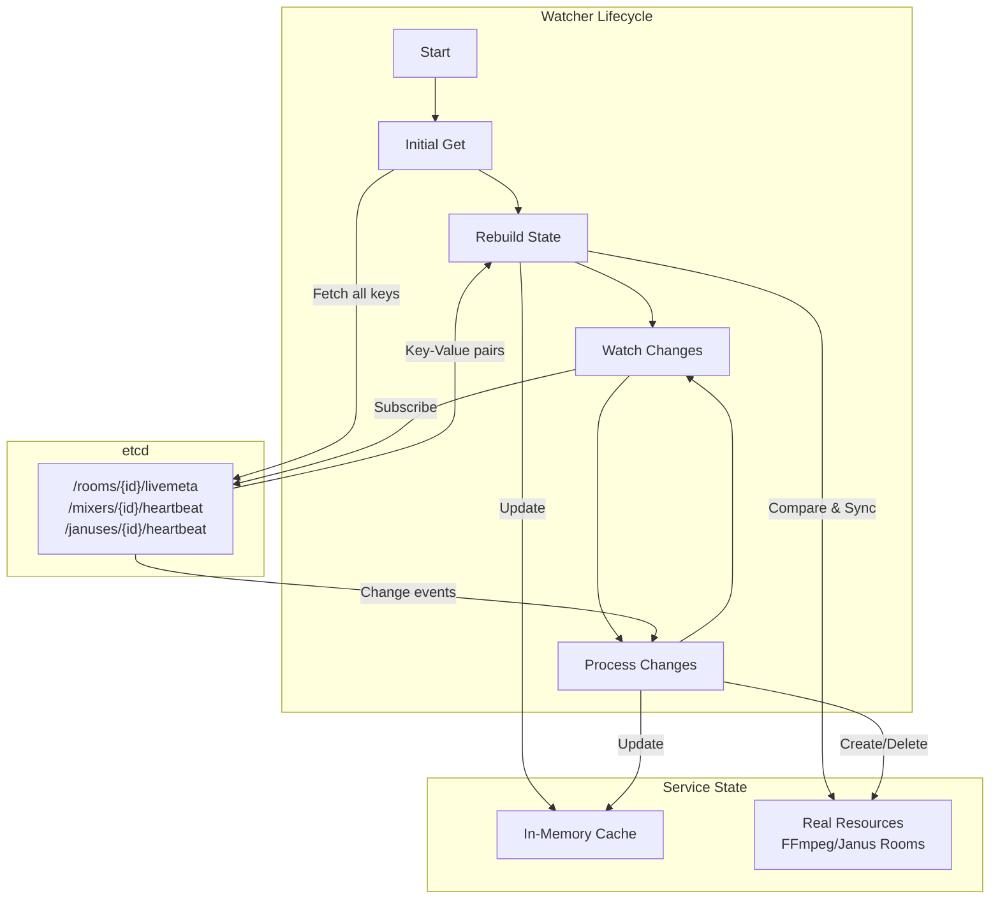

# Watcher Pattern

## Concept

The Watcher pattern is a core architectural component that enables reactive, event-driven state synchronization between etcd and service components. It solves the challenge of keeping distributed services in sync with centralized state stored in etcd.

**Key Reference**: [golang/pkg/watcher/etcd/watcher.go](../golang/pkg/watcher/etcd/watcher.go)

## How It Works



## Core Features

1. **Initial State Fetch**
   - On startup, fetches all keys with specified prefix from etcd
   - Builds initial in-memory cache of current state
   - Gets revision number for continuous watching

2. **State Rebuild**
   - Compares etcd state with actual running resources (FFmpeg processes, Janus rooms)
   - Cleans up inconsistencies (e.g., removes orphaned processes)
   - Ensures service state matches etcd state after restart

3. **Continuous Watching**
   - Watches etcd for changes starting from last known revision
   - Processes PUT/DELETE events in real-time
   - Updates in-memory cache automatically

4. **Change Processing with Retry**
   - Uses KeyedScheduler for intelligent task scheduling
   - **Deduplication**: Groups changes by resource ID - if multiple events arrive for same ID, only earliest scheduled time is kept
   - **Exponential Backoff**: Automatically retries on failure with increasing delays (100ms → 200ms → 400ms → 800ms → ... → 10s max)
   - **Priority Queue**: Uses min-heap to efficiently schedule next task based on timestamp
   - **Ordered Execution**: Tasks fire in chronological order, preventing thundering herd

5. **Automatic Recovery**
   - Detects etcd connection failures
   - Automatically restarts get-and-watch cycle
   - Rebuilds state to recover from network partitions

## Key Format

```
{prefix}{id}/{keyType}
```

Example:
```
/rooms/room1/livemeta    → prefix="/rooms/", id="room1", keyType="livemeta"
/mixers/mixer5/heartbeat → prefix="/mixers/", id="mixer5", keyType="heartbeat"
```

## Generic Implementation

The watcher is implemented using Go generics ([watcher.go:46](../golang/pkg/watcher/etcd/watcher.go#L46)):

```go
type BaseEtcdWatcher[T any] struct {
    cache         map[string]*T          // In-memory state cache
    processChange ProcessChangeFunc[T]   // Callback for handling changes
    stateTrans    StateTransformer[T]    // State transformation logic
    scheduler     *scheduler.KeyedScheduler // Task scheduler with dedup & retry
}
```

## KeyedScheduler: Deduplication & Retry Backoff

The KeyedScheduler ([pkg/scheduler/scheduler.go](../golang/pkg/scheduler/scheduler.go)) is a critical component that handles task scheduling with intelligent deduplication and retry logic:

**How it works**:

```go
// Enqueue task with delay
scheduler.Enqueue("room1", 0)           // Execute immediately
scheduler.Enqueue("room1", 5*time.Second) // Schedule 5s later - IGNORED (earlier exists)
scheduler.Enqueue("room2", 3*time.Second) // Different key, scheduled

// On failure, retry with exponential backoff
func nextDelay(attempt int) time.Duration {
    baseDelay := 100ms * (1 << attempt)  // 2^attempt
    if baseDelay > 10s {
        baseDelay = 10s  // Cap at 10 seconds
    }
    return baseDelay
}
// attempt 0: 100ms
// attempt 1: 200ms
// attempt 2: 400ms
// attempt 3: 800ms
// attempt 4: 1.6s
// attempt 5+: 10s (capped)
```

**Key Features**:
- **Automatic Deduplication**: Multiple events for same resource ID are collapsed into one task
- **Earliest Wins**: When duplicate keys are enqueued, only the earliest timestamp is kept
- **Min-Heap Priority Queue**: Efficiently schedules next task O(log n) insertion
- **Prevents Thundering Herd**: Tasks execute in chronological order with controlled delays
- **Retry Counter Reset**: On new event, retry counter resets for fresh processing

**Example Flow**:
```
1. room1 PUT event → Enqueue("room1", 0ms) → Scheduled at T+0
2. room1 PUT event → Enqueue("room1", 0ms) → Ignored (T+0 already scheduled)
3. Process fails → Enqueue("room1", 100ms) → Rescheduled at T+100
4. room1 DELETE event → Enqueue("room1", 0ms) → Replaces T+100, scheduled at T+0
5. Process succeeds → Retry counter reset
```

## Real-World Usage Examples

**Mixer Room Watcher** ([mixers/watcher/watcher.go](../golang/mixers/watcher/watcher.go)):
- Watches `/rooms/{roomId}/livemeta`
- When assigned a room (mixerId == self), allocates RTP port and starts FFmpeg
- When room deleted, stops FFmpeg and releases port

**Janus Manager Room Watcher** ([januses/watcher/room_watcher.go](../golang/januses/watcher/room_watcher.go)):
- Watches `/rooms/{roomId}/livemeta` and `/rooms/{roomId}/mixer`
- When assigned (janusId == self), creates AudioBridge room
- When mixer appears, creates RTP forwarder

**Resource Manager Health Watcher** ([rooms/service/resource_manager.go](../golang/rooms/service/resource_manager.go)):
- Watches `/mixers/{id}/heartbeat` and `/januses/{id}/heartbeat`
- Tracks healthy instances for PickMixer/PickJanus selection
- Automatically removes unhealthy instances when heartbeat expires

## Benefits

1. **Decoupling** - Services react to state changes without direct communication
2. **Resilience** - Automatic recovery from network failures and service restarts
3. **Consistency** - Single source of truth (etcd) with eventual consistency
4. **Type Safety** - Generic implementation provides compile-time type checking
5. **Error Handling** - Built-in retry logic with exponential backoff
